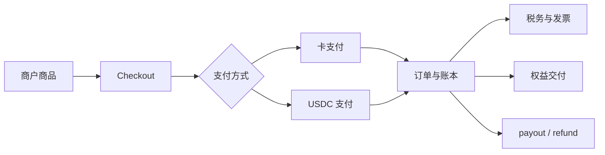

# 支付轨道总览

Harness.pay 同时支持两条支付轨道：[[Web2 卡支付]] 和 [[Web3 USDC 支付]]。两者最终进入统一的账本、税务、权益和 payout 流程。

## 对比

| 维度 | Web2 卡支付 | Web3 USDC 支付 |
| --- | --- | --- |
| 形态 | 拉式、即时授权 | 推式、概率确认 |
| 支付服务 | Stripe | 自建 Base 链通道 |
| 资产 | 法币卡 | USDC |
| 主要状态 | 授权、扣款、退款、拒付 | 报价、等待确认、确认、归集、兑换 |
| 售后 | 原路退款和拒付争议 | 平台主动出金，依赖备付池 |
| 新增风险 | 拒付、盗卡、账户接管 | 少付、多付、错链、错币、过期、KYT 风险 |

## 统一主流程

支付异常统一进入 [[退款与异常]]，资金和对账规则见 [[03-资金与合规/资金与账本]]。
