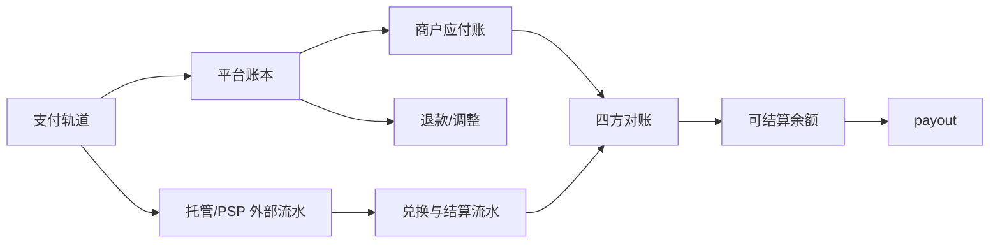

# 资金与账本

## 三类财务事实

- **交易账本**：订单、商品、费用、税、发票、退款和争议。
- **资金账本**：卡/链上收款、托管、归集、兑换、手续费、备付池和 payout。
- **商户应付账**：商户毛额、平台费、税、退款分摊、准备金和可结算余额。

商户应付账不是平台收入，税款和受限准备金也不是可自由支配的运营现金。

## Crypto 四方对账

```text
链上流水 + 托管钱包 + 兑换流水 + 平台账本
```

日终自动匹配并告警差异。未解释差异不能计入可结算余额，也不能关闭账期。

## 资金主流程



## 待决策事项

- 托管签名：第三方托管服务商还是自管 MPC。
- 兑换路径：Circle Mint 还是 On/Off-ramp 服务商。
- 分账模式：每商户派生地址、统一归集、账本分账的混合模式仍需法务复核。
- 大陆商户的法币入境与稳定币结算路径。
