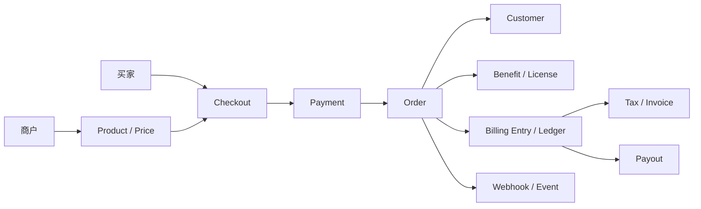

# Polar.sh 项目说明

## 1. 文档目的

Harness.pay 当前以 Polar.sh 的开源项目作为业务和技术基座。本文件用于帮助新成员建立三层认识：

1. Polar.sh 本身解决什么问题。
2. Polar 的核心对象、交易链路和代码结构如何组织。
3. Harness.pay 在 Polar 基座之上要保留、替换和新增什么能力。

本文描述的是当前 workspace 中可见的代码结构和 Harness 产品资料。代码仓库仍大量使用 `polar` 包名，因此阅读代码时应以“Polar 原生能力”和“Harness 改造”两条线分别判断，不能仅凭目录名称推断某项能力已经完成改造。

## 2. Polar.sh 是什么

Polar 是面向数字产品开发者的 Merchant of Record（MoR）和开发者收费平台。它把商品管理、定价、Checkout、支付、订阅、客户权益、税务、退款、争议、商户 payout 和 API/SDK 集成放在同一套系统中。

对商户来说，Polar 不只是一个支付按钮，而是数字产品销售后的完整运营闭环：

```text
创建组织 -> 配置商品和价格 -> 买家 Checkout -> 支付
-> 创建订单/订阅 -> 发放权益 -> 税务与收据
-> 退款/争议处理 -> 余额与 payout
```

Polar 的业务前提是：平台以自己的卖家身份承接交易相关责任，再根据交易结果向商户结算。这个模型是 Harness.pay 复用 Polar 作为基座的主要原因。

## 3. 核心业务模型

| 对象 | 作用 | 关联对象 |
| --- | --- | --- |
| Organization | 商户在平台中的业务边界和权限边界 | User、Product、Order、Payout |
| Product | 商户对外销售的数字产品 | Product Price、Benefit |
| Product Price | 产品的一次性或循环计费规则 | Product、Subscription、Order |
| Checkout | 买家选择商品、填写信息并完成付款的入口 | Product、Order、Payment |
| Order | 一次购买的商业事实和交付依据 | Customer、Product、Payment、Benefit |
| Subscription | 循环计费的持续关系 | Customer、Product Price、Order |
| Customer | 买家身份和购买关系 | Order、Subscription、Customer Portal |
| Benefit | 付款后交付给客户的权益 | Order、Subscription、Customer |
| Payment / Transaction | 支付和资金处理记录 | Order、Refund、Payout |
| Refund / Dispute | 售后退款和支付争议 | Order、Payment、Customer |
| Payout | 平台向商户进行的结算 | Organization、余额、Payout Account |
| Webhook / Event | 向商户系统同步业务状态 | Order、Subscription、Payment 等 |

其中，`Order`、`Subscription`、`Payment`、`Benefit` 和 `Payout` 共同形成从收入到交付再到商户结算的主链路。`Organization` 既是多租户隔离单位，也是授权、商品归属和财务归属的关键边界。

## 4. 代码架构

### 4.1 Workspace 项目

| 项目 | 主要职责 |
| --- | --- |
| `harness-backend` | Polar 后端 API、业务服务、数据模型、异步任务、迁移和运营后台 |
| `harness-dashboard` | Dashboard、公开 Web 页面、Checkout UI、设计系统和前端 SDK/client |
| `harness-sdk` | OpenAPI/Schema 生成器，以及 Python、TypeScript SDK |
| `obsidian/harness-pay` | Harness.pay 的产品、业务、合规和实施文档 |

### 4.2 后端

后端是 Python/FastAPI 应用，入口为 `polar/app.py`。主要边界如下：

- `polar/models`：SQLAlchemy 数据模型和数据库关系。
- `polar/organization`、`polar/user`、`polar/authz`：用户、组织和权限。
- `polar/product`、`polar/checkout`、`polar/checkout_link`：商品、价格和购买入口。
- `polar/customer`、`polar/customer_portal`、`polar/customer_seat`：买家身份、客户门户和席位权益。
- `polar/order`、`polar/subscription`、`polar/payment`：订单、订阅和支付状态机。
- `polar/benefit`、`polar/license_key`：付款后的权益和授权交付。
- `polar/refund`、`polar/dispute`、`polar/receipt`、`polar/invoice`：售后、收据和发票。
- `polar/tax`：税务计算和税务相关数据。
- `polar/payout`、`polar/payout_account`、`polar/billing_entry`：余额、账务条目和商户结算。
- `polar/webhook`、`polar/event`、`polar/eventstream`：事件生产、Webhook 和实时事件。
- `polar/worker`：Dramatiq worker、定时任务和异步处理。
- `polar/backoffice`：内部运营后台，用于处理组织、客户、订单、payout、Webhook 等运营对象。

后端的运行和质量检查入口集中在 `harness-backend/pyproject.toml`，包括 `task api`、`task worker`、`task test`、`task lint_check` 和 `task lint_types`。

### 4.3 Dashboard

`harness-dashboard` 是 pnpm + Turborepo 的前端 monorepo：

- `apps/app`：登录后的组织 Dashboard 和管理功能。
- `apps/web`：公开网站、Checkout、客户门户以及面向买家的页面。
- `apps/orbit`：Orbit 设计系统和组件展示。
- `packages/checkout`：Checkout 相关可复用前端能力。
- `packages/client`：从 API/OpenAPI 生成或封装的客户端能力。
- `packages/ui`、`packages/orbit`、`packages/i18n`：UI、设计系统和国际化基础设施。

根目录脚本提供 `pnpm dev`、`pnpm build`、`pnpm lint`、`pnpm typecheck` 和 `pnpm test`。

### 4.4 SDK

`harness-sdk` 负责把 API 规范转化为开发者可使用的客户端：

- `generator`：读取 API 描述，生成 Python/TypeScript 类型和客户端代码。
- `overlays`：对生成过程追加只读字段、安全属性、事件元数据和时区等规则。
- `python`：Python SDK 基础实现和测试。
- `typescript`：TypeScript SDK 基础实现和测试。

因此，API 字段或事件模型发生变化时，不能只修改某个 SDK 文件，应同步检查后端 Schema、OpenAPI 生成流程、overlay 和两种语言的测试。

## 5. Harness.pay 的改造关系

### 5.1 直接复用的 Polar 能力

Harness.pay 可以直接建立在以下 Polar 能力之上：

- Organization、用户、角色和商户权限。
- Product、Price、Checkout、Checkout Link。
- Customer、Order、Subscription 和 Customer Portal。
- Benefit、License Key 和客户权益交付。
- Payment、Refund、Dispute、Receipt、Invoice。
- Webhook、API、SDK 和 Dashboard。
- 税务、账务条目、payout 和内部运营后台的基础框架。

这些能力对应 Harness 当前 Phase 1/Phase 2 的“先跑通 Polar 基座和 Web2 MoR 闭环”方向。具体是否已接入、中文化或替换，应以实现代码和实施路线为准。

### 5.2 Harness 需要改造或新增的能力

Harness.pay 的差异化不应通过复制一套平行的 Billing 系统实现，而应尽量把新支付轨道接入 Polar 已有的订单、账本、权益和 payout 边界：

| 改造方向 | 与 Polar 的关系 |
| --- | --- |
| 品牌、中文化和 onboarding | 替换默认产品体验，保留底层组织和权限模型 |
| Web2 MoR | 复用 Polar 的商品、卡支付、税务、订单、权益和 payout 闭环 |
| Base 链 USDC | 新增支付方式、链上监听、确认、KYT、归集和兑换，但最终写入统一订单/账本/结算链路 |
| Crypto 退款 | 在 Polar 退款模型上增加链上主动出金、退款地址和交易状态 |
| Crypto 对账 | 将链上交易、兑换和归集结果映射到平台账务条目及运营后台 |
| Agent-native MoR | 在现有授权、订单、交付、退款和对账能力上增加 Agent 身份、任务和授权上下文 |

当前产品资料将 Web3 USDC 和 Agent-native MoR 作为 Harness 的扩展方向；不能把这些方向自动视为 Polar 已有能力。

## 6. 一次交易如何穿过系统



Web2 卡支付通常由支付处理器返回支付结果；订单和订阅服务根据结果推进状态，权益服务负责交付，账务服务记录收入、费用和应结金额，Webhook 把状态通知商户。Harness 的 USDC 轨道需要把“支付处理器返回结果”替换或扩展为“链上交易监听和确认”，但后续业务事实仍应回到同一套订单、权益、账务和结算模型。

## 7. 研发阅读顺序

新成员可以按下面顺序建立上下文：

1. 先读 `docs/01-业务总览.md` 和 `docs/business-overview.md`，理解 Harness 的 MoR 边界。
2. 读后端 `polar/models`，确认对象、外键和状态字段。
3. 沿 `polar/checkout` -> `polar/payment` -> `polar/order` -> `polar/benefit` 阅读一次购买链路。
4. 再读 `polar/subscription`、`polar/refund`、`polar/dispute`、`polar/payout`，补齐持续计费和售后结算。
5. 查看 `harness-dashboard/apps/app`、`apps/web` 和 `packages/checkout`，对应后台、Checkout 与客户页面。
6. 最后查看 `harness-sdk/generator`、`overlays` 和 Python/TypeScript SDK，理解 API 如何交付给商户。
7. 涉及 Harness 新能力时，同时对照 `docs/02-支付业务`、`docs/03-资金与合规` 和 `docs/05-实施路线`。

## 8. 开发边界和注意事项

- 不要因为模块位于 `polar/` 下，就默认它已经适配 Harness 的法律主体、品牌、中文化或业务政策。
- 新支付方式应优先复用 Order、Customer、Benefit、Billing Entry、Refund 和 Payout 的业务边界，避免形成第二套账。
- 支付状态、订单状态、订阅状态、权益状态和账务状态不是同一个状态机；修改一个状态时要检查事件和 Webhook 的影响。
- 所有组织级查询都必须遵守 Organization/用户授权边界；后端已有自定义 lint 规则检查组织范围查询。
- API 或事件模型变更后，应同时检查 Dashboard、SDK generator、overlays、Webhook 消费方和相关测试。
- USDC 支付的确认、KYT、归集、兑换、退款和对账属于 Harness 新增责任，不能直接套用卡支付的可逆性和争议模型。

## 9. 相关文档

- [[00-首页]]
- [[01-业务总览]]
- [[02-支付业务/支付轨道总览]]
- [[03-资金与合规/资金与账本]]
- [[05-实施路线/实施路线]]
- [[06-参考/源文件说明]]
- [[business-overview]]

## 10. 维护规则

当 Polar 基座的核心对象、代码仓库边界或 Harness 的支付轨道发生变化时，更新本文的“核心业务模型”“代码架构”和“Harness 改造关系”三节。产品目标或阶段变化则同时更新 `docs/05-实施路线/实施路线.md`，不要只修改本说明。
