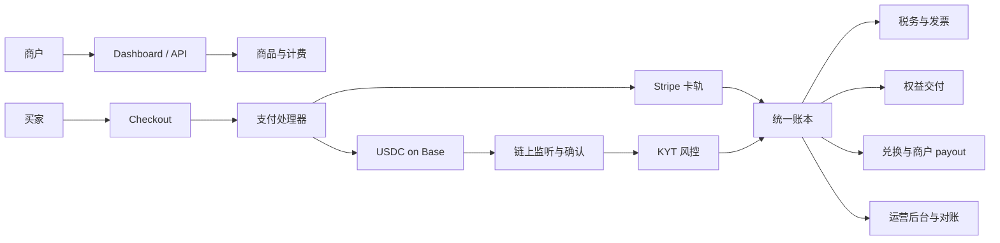
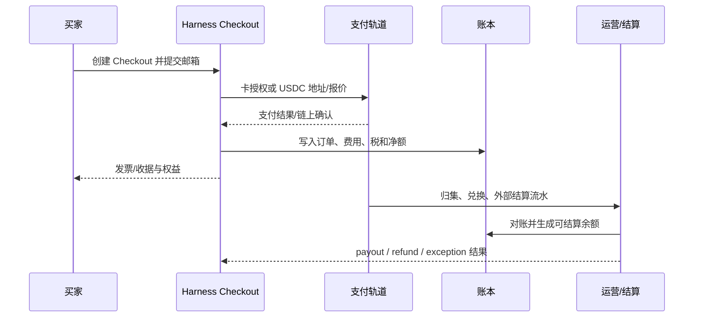

# Harness.pay 业务场景与产品概览

> 本文根据 `source/` 下的四份产品材料整理，面向产品、研发、运营和新成员快速理解业务。文中将“当前 Harness.pay 业务”与“Agent-native MoR 中长期方向”分开描述；策略、商业计划和产品规格中的目标数字均不等同于已上线事实。

## 1. 一句话理解

Harness.pay 是面向大陆/华语开发者的 Merchant of Record（MoR）平台，帮助开发者向欧美买家销售数字产品并完成收款、税务、退款、账本和商户结算。它以 Polar 开源系统为业务基座，沿用 Web2 卡支付能力，同时新增自建 Crypto 收款通道，首期支持 Base 链 USDC 直付。

平台以自己的卖家身份承接交易责任：买家付款给平台，平台负责订单、税务发票、权益交付、退款/争议和资金结算，再将应结算金额 payout 给商户。

长期方向是 Agent-native MoR：将同一套 MoR 责任能力扩展为 Agent 交易的责任与财务执行层，解决“谁授权 Agent、Agent 买了什么、任务是否交付、如何计费、如何退款和如何对账”等问题。

## 2. 当前业务场景

### 2.1 目标供给侧

- 主力客户是出海的大陆/华语开发者、独立开发者和 AI 初创公司。
- 典型商户销售 SaaS、AI API、数字工具、订阅或其他数字权益，买家主要在欧美。
- 商户通常难以自行开设并维护 Stripe、海外银行账户、税务和跨境结算体系，因此购买的是“可出海的完整收款与责任闭环”，而不只是支付按钮。
- Crypto/Web3 开发者是战略切入客群，因为传统 MoR 对 Crypto 支付覆盖不足。

### 2.2 目标需求侧

买家可以通过 Checkout 使用银行卡或 USDC 付款。付款后，平台向买家发放订阅、席位、软件授权码等权益，并保留客户、订单、支付和退款所需的信息。

Crypto 买家在首期仍需填写邮箱。付款地址由系统自动记录为支付属性，默认退款回原付款地址；如需改绑退款地址，需要邮箱验证。

### 2.3 平台价值

对商户：

- 一个集成面接入卡支付和 Crypto 支付。
- 平台代为处理 MoR 名义下的税务、发票、退款、争议和 payout。
- 通过 Dashboard、REST API、SDK、Webhook、Checkout Link 和 Embed 接入。
- Crypto 收款可在确认后归集、兑换法币，并进入现有商户结算链路。

对平台：

- Polar 提供商品、价格、订阅、权益、客户门户、基础账本和运营后台等成熟能力，减少重写范围。
- 自建 USDC 收款通道形成差异化，并可降低对单一 PSP 的依赖。
- 两种支付轨道最终汇入同一账本和 payout 模型，便于统一财务运营。

## 3. 产品边界：当前能力与未来方向

| 范围 | 当前定位 | 关键能力 |
| --- | --- | --- |
| Phase 1 | 跑通 Polar 基座 | 部署、中文化、品牌替换、移除默认 onboarding、完成演示闭环 |
| Phase 2 | Web2 MoR 闭环 | AUP/KYB、商品、银行卡支付、权益、税务、账本、payout |
| Phase 3 | Web3 MoR 闭环 | USDC 直付、链上监听、KYT、归集、兑换、对账、退款、运营工具 |
| Phase 4 | Agent 原生接入 | X402/AP2、直连钱包、扩链扩币；触发条件驱动，当前只是预留方向 |

当前不应默认承诺的能力包括：Agent 已生产可用、开放式消费者钱包、全品类全球覆盖、Crypto credit 储值层、Stripe Crypto 通道、卡收单后再转稳定币结算，以及稳定币脱锚预案。

## 4. 业务架构

### 4.1 核心模块

1. **Billing / 商品计费**：商品、固定价、买家自定价、按用量/席位、一次性和循环订阅、优惠码、免费试用、结账字段、用量事件和周期出账。
2. **Payment / 交易支付**：Checkout、订单、卡支付、Crypto 支付、发票/收据、退款和争议。
3. **Customer / 客户权益**：客户档案、邮箱身份、Magic Link、自助 Portal、席位、授权码和权益发放。
4. **Settlement / 资金结算**：平台双录账本、手续费、商户余额、托管、归集、兑换、对账和 payout。
5. **Tax / 税务**：实时算税、税号校验、税务报表和 Crypto 发票适配；申报与代缴属于运营责任，依赖实际法律主体。
6. **Compliance / 合规风控**：商户 AUP、KYB、Crypto 地址 KYT，以及按阈值触发的买家 KYC。
7. **Operations / 运营支撑**：备付池监控、归集监控、txhash 查询、监听健康度、对账差异和退款权限。
8. **DevEx / 开发者接入**：REST API、TS/Python SDK、Webhook、OAuth2/PAT/组织令牌、Checkout Links、Embed 和接入文档。

### 4.2 依赖关系



## 5. 两条支付轨道

### 5.1 Web2 卡支付

这是较成熟的拉式支付：买家在 Checkout 授权，Stripe 完成收单，平台接收支付结果，发放权益并写入账本。典型流程是：

```text
商户入驻审核 -> 创建商品/价格 -> 买家 Checkout -> 卡支付 -> 税务/发票
-> 权益发放 -> 账本记录 -> 商户 payout
```

Web2 闭环是首批真实商户上线的基础，依赖法律主体、Stripe 收单账户、美欧银行账户和 Stripe Tax 配置。

### 5.2 Web3 USDC 支付

这是推式、概率确认且通常不可逆的支付。相较卡支付，多出报价有效期、链上监听、确认数策略、KYT、归集和兑换环节；没有卡拒付，但退款需要平台主动出金并依赖备付池。

首期主航道为：

```text
买家支付 USDC -> Base 链确认 -> 地址归集 -> KYT 筛查
-> 兑换法币 -> 多币种账本 -> 沿用 payout 结算商户
```

必须处理的异常包括少付、多付、超时到账、错链/错币和报价过期。交易订单需要展示链上支付状态和 txhash；运营后台需要能按 txhash 排查“已转账但未到账”。

## 6. 关键角色与责任

| 角色 | 业务含义 | 平台需要记录 |
| --- | --- | --- |
| 买家 | 购买数字商品或服务的一方 | 邮箱、客户档案、付款地址属性、订单和权益 |
| 商户 | 使用平台销售产品的开发者或企业 | AUP、KYB、商品、结算偏好、余额和 payout 账户 |
| Harness / MoR | 交易中的法律卖方，承接收款、税、发票、退款和争议 | Sale、Tax、Invoice、Refund、Dispute、Seller Payable |
| 支付/链上服务 | Stripe、RPC、托管钱包、兑换服务等外部基础设施 | 授权、确认、手续费、外部流水和结算状态 |
| 运营人员 | 处理异常、退款、对账和客服 | 操作人、权限、审批、工单、审计日志 |

MoR 的核心不是替商户转发付款，而是让每笔交易都能说明：谁买、向谁买、买了什么、税属于哪里、权益是否交付、钱去了哪里、失败后谁负责。

## 7. 端到端业务流程

### 7.1 商户侧

1. 注册并完成 AUP 申请与 KYB。
2. 平台审核商户经营范围、法律主体和结算信息。
3. 商户在 Dashboard 或 API 创建商品、价格、订阅、用量规则和权益。
4. 商户开启卡支付和/或 Crypto 收款，配置结算偏好。
5. 商户通过 Checkout Link、Embed 或 API 将结账能力接入自己的产品。
6. 商户在 Sales/Finance 查看订单、支付状态、税费、净额、链上信息和结算。

### 7.2 买家侧

1. 进入商户 Checkout，选择商品和支付方式。
2. 提交邮箱；卡支付进入卡授权，Crypto 支付获得金额、地址/二维码和倒计时。
3. 平台等待卡支付结果或链上确认。
4. 支付成功后生成订单、发票/收据并自动发放权益。
5. 买家可通过 Portal 查看订单、权益和售后状态。
6. 退款时按原支付轨道处理：卡原路退，USDC 通过平台出金，默认退回原付款地址。

### 7.3 平台资金侧



## 8. 账本、税务与对账

平台的财务事实不能只依赖订单状态。至少要分别维护：

- **交易账本**：订单、商品、费用、税、发票、退款和争议。
- **资金账本**：卡/链上收款、托管、归集、兑换、手续费、备付池和 payout。
- **商户应付账**：商户应收毛额、平台费、税、退款分摊、准备金和可结算余额。

Crypto 场景要求四方对账：链上流水、托管钱包、兑换流水和平台账本。日终发现差异需要告警，未解释差异不能被当作可结算余额或直接关闭账期。

税务沿用成熟的算税、税号校验和报表能力，但 Crypto 发票需要同时展示法币计价金额、支付资产和实际数量。税务申报、代缴、法律主体和适用国家范围不能只靠代码决定，必须由运营与专业顾问确认。

## 9. 合规与风险控制

- 商户侧：重写 AUP，不能沿用会拒绝 Crypto 商户的默认规则；接入 KYB，并把审核状态反馈到入驻流程。
- 买家/交易侧：对 Crypto 入账地址执行 KYT，覆盖制裁、黑名单、混币器等风险；KYC 按金额或风险阈值触发，阈值仍需在详细 PRD 和法律评审中确定。
- 资金侧：托管签名、归集、兑换和备付池要有权限、额度和监控；高权限退款、动资金和结算配置需要分级授权。
- 运营侧：客服、运营和超级管理员权限分离；保留审计日志、txhash、外部流水、处理人和审批记录。
- 产品侧：拒绝、少付、过期、超时、错链错币等异常应进入明确处理状态，不能静默地发放权益或吞掉资金。

## 10. Agent-native MoR 中长期模型

这是未来产品架构方向，不代表当前 Harness.pay 已具备生产能力。

Agent 不是独立法律人格，首期应视为经过验证的 Principal 的受限执行者。关键对象为：

```text
Principal -> Agent Identity -> Mandate -> Quote -> Task
-> Usage / Evidence -> Acceptance -> Payment -> Tax / Invoice
-> Ledger -> Refund / Dispute -> Settlement
```

长期产品要把以下问题纳入统一控制面：

- **Principal**：真正承担预算、税务和法律后果的人或企业。
- **Agent Identity**：Provider、实例、版本、密钥和撤销状态。
- **Mandate**：限定商户、商品类别、金额、频率、地区、时间和订阅范围的可撤销授权。
- **Quote / Task**：机器可读的能力、价格、预算上限、SLA、成功条件、证据格式和退款规则。
- **Usage / Evidence**：模型、token、工具、运行时、重试、结果哈希、签名和交付证明。
- **Money / Commercial / Usage 三本账**：分别记录原始使用事实、客户商业价格和真实资金移动。

Agent 场景的黄金路径是：

```text
Discover -> Quote -> Authorize -> Reserve -> Execute -> Meter
-> Evidence -> Finalize -> Settle
```

关键原则是“先授权后调用、先预留再执行、交付证据后结算、失败可释放或退款”。自然语言或模型输出不能直接形成不可逆支付；确定性策略引擎必须校验授权、预算、风险和幂等性。

## 11. 实施路线与验收

### Phase 1：基座与演示

- 跑通 Polar 测试环境。
- Dashboard、Checkout、Portal 中文化，清理硬编码文案和 Polar 品牌残留。
- 完成商品创建和测试卡支付演示。

### Phase 2：Web2 真实闭环

- AUP/KYB 入驻、卡支付、税务发票、权益、账本和 payout 全链路跑通。
- 目标闭环：大陆测试商户入驻 -> 建商品 -> 欧美买家用卡支付 -> 权益发放 -> 账本可见净额 -> 商户收到 payout。
- 依赖法律主体、Stripe 账户、美欧银行账户和 Stripe Tax 配置。

### Phase 3：Web3 真实闭环

- USDC on Base 直付、链上监听、异常单处理、托管归集和法币兑换。
- 接入 KYT，完成多币种账本、四方对账、Crypto 发票、运营查询工具和退款设计。
- 目标闭环：USDC 支付 -> 链上确认 -> 权益发放 -> 归集兑换 -> 商户结算，同时拦截黑名单地址。
- 验收重点是连续 7 天无未解释对账差异，异常单不造成资损。

### Phase 4：Agent 接入

按协议级需求和客户需求触发，逐步评估 X402/AP2、直连钱包、扩链扩币和移动端，不作为当前基础闭环的前置条件。

## 12. 当前最大阻塞点

1. **法律主体与账户**：没有可承责法律主体、Stripe 账户和美欧银行账户，Phase 2 不能做真实收款和结算。
2. **托管与签名方案**：决定使用第三方托管还是自管 MPC，直接影响 Phase 3 钱包与归集设计。
3. **兑换路径**：Circle Mint 与 On/Off-ramp 服务商的选择影响资金敞口、批量兑换和运营流程。
4. **分账与法务**：每商户派生地址、统一归集、账本分账的混合模式仍需法务复核。
5. **zkMe 能力边界**：KYB 接入影响 Phase 2，KYT 接入影响 Phase 3。
6. **大陆商户结算路径**：法币入境与稳定币结算的优先级需要按商户主体和实际账户条件决策。
7. **非美欧买家范围**：当前税务栈聚焦美欧，其他国家应明确拦截、限制或单独配置，不能默认全球开放。

## 13. 业务术语

- **MoR**：Merchant of Record，交易中的法律卖方/转售方，承担收款、间接税、发票、退款、争议和商户结算责任。
- **AUP**：Acceptable Use Policy，可接受使用政策，用于商户经营范围和禁限售审核。
- **KYB / KYC / KYT**：企业、个人和链上地址的身份/风险审查。
- **Payout**：平台向商户发放可结算余额。
- **备付池**：平台为退款、结算时间差和风险事件保留的资金池。
- **Quote**：带金额、有效期、条款和支付轨道的报价。
- **Mandate**：Principal 对 Agent 的细粒度、可撤销行动授权。
- **Task**：可执行、可计量、可交付和可验收的任务对象，不等同于最终 Sale。
- **Evidence**：用于证明身份、用量、交付、验收或争议事实的摘要、签名和受控引用。

## 14. 源文件与阅读说明

| 源文件 | 本文吸收的内容 |
| --- | --- |
| `AI_Native_MoR_Strategy_2026_CN.docx` | Agent-native MoR 的战略判断、协议栈、角色、Task Envelope、三本账和长期产品模块 |
| `Agent_Native_MoR_Business_Plan_2026_CN.docx` | 客户画像、商业模式、验证计划、运营指标、风险和融资/增长假设 |
| `Programmable_MoR_Product_Spec_2026_CN.docx` | P0 产品规格、对象模型、状态机、API、验收标准和发布门槛 |
| `Harness.pay 产品功能规划 v1.1 - 2026.07.20.pdf` | Harness.pay 当前定位、Polar 基座、Web2/Web3 两轨、Phase 1-4、功能清单和阻塞决策 |

上述材料存在“当前项目执行计划”和“未来 Agent 产品规格”两个时间尺度。做研发拆解时，应优先以 Harness.pay Phase 计划和后续评审结论确定当前范围；做平台架构设计时，再参考 Agent-native MoR 的 canonical objects、三本账和黄金路径。
